<h2 align="center">Hi, I'm Dani 👋</h2>

  <b>Full-stack developer with 10+ years of experience building web, mobile and automation software</b>

  
  
  

- 💼 Currently working at [Epistemonikos](http://foundation.epistemonikos.org/)
- 🌎 Working remotely since 2018
- 🛠️ I take products from idea to production: frontend, backend, mobile apps, data modeling and deployment
- 🤖 I love automating things: bots, computer vision and anything that saves a click
- 🎮 Side quest: building games with Godot, Unity and Phaser
- ⚡ Fun fact: I use tabs over spaces

## Tech stack

**Languages** 

**Frontend & mobile** 

**Backend & data** 

**DevOps & cloud** 

**Testing** 

**Games, vision & ML** 

Also: React Native, Hasura, Phaser, Storybook, PWAs and Solana.

## GitHub stats

  

  

